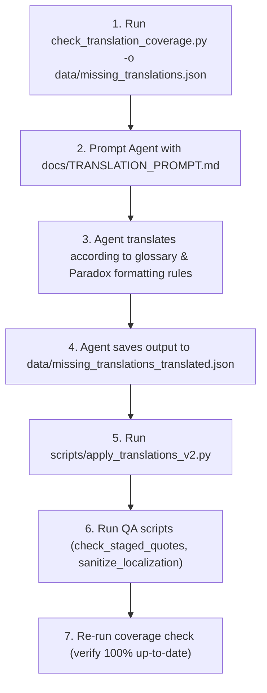

# Galactic Behemoths - Localization Subproject (`gtsra_l10n`)

This repository manages the English localization for the Stellaris mod **Galactic Behemoths** ([`GTSRA/gtsra`](https://github.com/GTSRA/gtsra)).

Source Simplified Chinese localization files (`localisation/simp_chinese`) are synchronized from the upstream repository, and translated into English (`localisation/english`). This repository provides automated tooling to measure translation coverage, track changes, and coordinate AI Agent-assisted translation pipelines.

---

## Table of Contents

- [Directory Structure](#directory-structure)
- [Prerequisites & Setup](#prerequisites--setup)
- [Checking Translation Coverage](#checking-translation-coverage)
  - [Basic Usage](#basic-usage)
  - [Understanding the Report](#understanding-the-report)
  - [Detection Methods (Missing vs. Outdated)](#detection-methods-missing-vs-outdated)
  - [CLI Flags & Options](#cli-flags--options)
- [Instructing an AI Agent to Translate](#instructing-an-ai-agent-to-translate)
  - [Standard Agent Translation Workflow](#standard-agent-translation-workflow)
  - [Step 1: Export Keys Needing Translation](#step-1-export-keys-needing-translation)
  - [Step 2: Prompting the Agent](#step-2-prompting-the-agent)
  - [Step 3: Agent Output Requirements](#step-3-agent-output-requirements)
  - [Step 4: Applying Translations](#step-4-applying-translations)
  - [Step 5: Quality Assurance & Sanitization](#step-5-quality-assurance--sanitization)
- [Upstream Synchronization](#upstream-synchronization)

---

## Directory Structure

```text
├── localisation/
│   ├── simp_chinese/       # Source Chinese localization files (synced from upstream)
│   ├── replace/            # Chinese override files
│   └── english/            # Target English localization files
├── data/
│   ├── glossary.json       # Machine-readable glossary and terminology mappings
│   ├── translation_lock.json # Lockfile recording the source text state of translated keys
│   ├── missing_translations.json            # Exported missing/outdated keys to be translated
│   ├── missing_translations_translated.json # Translated output produced by the agent
│   └── missing_translations_translated_schema.json # JSON Schema for translated output
├── docs/
│   ├── TRANSLATION_PROMPT.md  # Standardized prompt instructions for AI translation agents
│   └── glossary.md            # Comprehensive project glossary and naming conventions
├── scripts/
│   ├── check_translation_coverage.py  # Calculates coverage and exports missing/outdated keys
│   ├── apply_translations_v2.py       # Merges translated JSON into English YAML & updates lockfile
│   ├── check_staged_quotes.py         # Validates quote formatting in staged localization files
│   ├── fix_quotes_script.py           # Auto-fixes unescaped/missing quotes in localization files
│   ├── remove_duplicate_keys.py       # Identifies and removes duplicate keys across files
│   └── sanitize_localization.py       # Cleans indentation and removes redundant comments
└── requirements.txt        # Python dependencies (e.g. ruamel.yaml)
```

---

## Prerequisites & Setup

All scripts require **Python 3.8+**. It is strongly recommended to use a virtual environment:

```bash
# Create virtual environment
python3 -m venv .venv

# Activate virtual environment
source .venv/bin/activate

# Install dependencies
pip install -r requirements.txt
```

> **Note:** Whenever executing scripts directly or instructing an Agent, always prioritize using `.venv/bin/python` (or activating the virtual environment beforehand).

---

## Checking Translation Coverage

The translation coverage tool [`scripts/check_translation_coverage.py`](scripts/check_translation_coverage.py) scans all Chinese and English localization YAML files to determine:
1. Missing keys (keys present in Chinese but missing entirely from English).
2. Outdated keys (keys translated into English in the past, but whose source Chinese text has changed).
3. Overall translation coverage and up-to-date coverage percentages.

### Basic Usage

Run the coverage checker directly:

```bash
.venv/bin/python scripts/check_translation_coverage.py
```

### Understanding the Report

Running the script outputs a summary report similar to:

```text
==================================================
Translation Coverage Report
==================================================
Total Chinese Keys: 23797
Keys with Empty Original: 1057 (excluded from coverage)
Total Eligible for Translation: 22740
Total English Keys: 22125
Missing Translations: 2573
Outdated Translations: 295 (Detection: Lockfile + Comments fallback)
Coverage (ignoring outdated): 88.69%
Up-to-date Coverage: 87.39%
==================================================
```

- **Total Chinese Keys**: Total count of localization keys found in `localisation/simp_chinese/`.
- **Keys with Empty Original**: Source keys with empty values (e.g. `key: ""`), excluded from translation requirements.
- **Total Eligible for Translation**: Total keys requiring translation (`Total Chinese Keys - Empty Keys`).
- **Missing Translations**: Keys that do not exist in `localisation/english/`.
- **Outdated Translations**: Keys translated into English whose source text changed in Chinese.
- **Coverage (ignoring outdated)**: `(Eligible - Missing) / Eligible * 100%`. Measures raw presence of English keys.
- **Up-to-date Coverage**: `(Eligible - Missing - Outdated) / Eligible * 100%`. Measures translation completeness reflecting latest source text.

### Detection Methods (Missing vs. Outdated)

The tool detects outdated keys through a three-tier hierarchy:

1. **Lockfile (`data/translation_lock.json`)**:
   The primary source of truth. When translations are applied, the original Chinese string is recorded in the lockfile. If the current Chinese text differs from the lockfile entry, the key is flagged as `outdated`.
2. **English File Comments Fallback**:
   If a key is missing from the lockfile, the script inspects the comment directly preceding the key in the English YAML file (where `apply_translations_v2.py` writes `# <original_chinese>`).
3. **Git Diff (`-c <commit>`)**:
   Compares the current Chinese localization files against a specified commit hash to find modified lines.

### CLI Flags & Options

| Flag | Description | Example |
| :--- | :--- | :--- |
| `-o`, `--output <path>` | Export missing and outdated entries into a JSON file for translation | `-o data/missing_translations.json` |
| `-d`, `--details` | Print detailed warnings and lists of missing/outdated keys grouped by file | `-d` |
| `-c`, `--commit <hash>` | Compare against a specific Git commit hash using `git diff` | `-c HEAD~10` |
| `-l`, `--lockfile <path>` | Specify a custom translation lockfile path | `-l custom_lock.json` |
| `--init-lock` | Initialize/generate `data/translation_lock.json` from the current state and exit | `--init-lock` |

---

## Instructing an AI Agent to Translate

An AI Agent (such as Gemini or Claude in an agentic environment) can be assigned translation batches. Follow the standard procedure below.

### Standard Agent Translation Workflow



### Step 1: Export Keys Needing Translation

Generate the list of missing and outdated keys into `data/missing_translations.json`:

```bash
.venv/bin/python scripts/check_translation_coverage.py -o data/missing_translations.json
```

Each generated item will have either:
- `"status": "missing"`: Newly added key without any English translation.
- `"status": "outdated"`: Existing key whose Chinese text was modified. Contains both `"new_original"` (latest text to translate) and `"old_original"` (previous text for diff context).

### Step 2: Prompting the Agent

Provide the agent with the task instructions defined in [`docs/TRANSLATION_PROMPT.md`](docs/TRANSLATION_PROMPT.md). You can copy the content of `docs/TRANSLATION_PROMPT.md` or instruct the agent to view that file.

#### Essential Rules for the Agent

1. **Strict Glossary Compliance (Highest Priority)**:
   The agent MUST adhere to [`data/glossary.json`](data/glossary.json) and [`docs/glossary.md`](docs/glossary.md). Common critical terms include:
   - **Characters & Factions:**
     - 希诺 $\to$ `Xino` (Never use *Xinuo* or *Xilonen*)
     - 法拉 $\to$ `Fara`
     - 亚绒 $\to$ `Yarong`
     - 艾雅法拉 $\to$ `Eyjafjalla`
     - 白 $\to$ `Shiro`
     - 舰娘 / 艦娘 $\to$ `Shipgirl` (Never use *Kanmusu*)
     - 纯真智械 $\to$ `Innocent Machine`
     - Bruh系列 $\to$ `Bruh Series`
   - **Theme Scales & Mechanics:**
     - 巨娘 / 巨大娘 $\to$ `Giantess`
     - 小人 $\to$ `Tiny person` (plural: `Tinies` or `Tiny people`)
     - 缩小人 $\to$ `Shrunken person`
     - 缩小城市 $\to$ `Shrunken city`
     - 尺度分级 $\to$ `Titan` (泰坦) / `Giant` (巨大) / `Tall` (高大) / `Normal` (常规) / `Small` (小型) / `Tiny` (微型) / `Micro` (微观) / `Macro` (宏观)
   - **Special Byproducts & Items:**
     - 汗液 $\to$ `Sweat`
     - 足汗 $\to$ `Foot Sweat`
     - 爱液 $\to$ `Love fluid`
     - 消化液 $\to$ `Digestive fluid`
     - 神液 $\to$ `Divine fluid`
     - 体液 $\to$ `Bodily Fluids`
     - 胖次 $\to$ `Panties`
     - 核心元件 $\to$ `Core component`
     - 灵能罐头 $\to$ `The Psionic Can`
   - **Stellaris Vanilla Terms:**
     - 民事理念 $\to$ `Civic`
     - 特质 $\to$ `Trait`
     - 起源 $\to$ `Origin`
     - 飞升天赋 $\to$ `Ascension Perk`
     - 岗位 $\to$ `Job`
     - 区划 $\to$ `District`
     - 凝聚力 $\to$ `Unity`
2. **Preserve Paradox Syntax & Formatting**:
   - Color formatting tags: `§Y...§!`, `§R...§!`, `§G...§!`, `§M...§!`, `§H...§!`, etc.
   - Dynamic scopes & variables: `[Root.GetName]`, `[From.Owner.GetName]`, etc.
   - Localization cross-references: `$trait_xxx$`, `$civic_yyy$`.
   - Escape sequences: newline `\n` and double quotes inside values `\"`.
3. **Handle Outdated Keys**:
   - Provide the updated English translation matching `new_original`.
   - Retain `new_original` under the `"original"` property in the final output.

### Step 3: Agent Output Requirements

The Agent must write the results to `data/missing_translations_translated.json` matching the schema in [`data/missing_translations_translated_schema.json`](data/missing_translations_translated_schema.json):

```json
[
  {
    "file": "path/to/source_file_l_simp_chinese.yml",
    "key": "example_key",
    "original": "原始中文文本",
    "translation": "Translated English text"
  }
]
```

### Step 4: Applying Translations

Once the agent produces `data/missing_translations_translated.json`, run the application script:

```bash
.venv/bin/python scripts/apply_translations_v2.py
```

This script:
1. Loads target YAML files in `localisation/english/` using `ruamel.yaml` to preserve formatting and quotes.
2. Updates or inserts translated keys under the `l_english:` block.
3. Automatically inserts the source Chinese text as a comment directly above each key (e.g. `  # 原始中文文本`).
4. Updates entries in `data/translation_lock.json` to keep track of the latest translated state.

### Step 5: Quality Assurance & Sanitization

After applying translations, run the verification scripts:

1. **Verify Quote Formatting**:
   Check for unescaped or missing quotes in staged English YAML files:
   ```bash
   python scripts/check_staged_quotes.py
   ```
   If formatting issues exist, auto-repair them using:
   ```bash
   python scripts/fix_quotes_script.py
   ```

2. **Deduplicate Keys**:
   Ensure no duplicate keys were introduced:
   ```bash
   python scripts/remove_duplicate_keys.py localisation/english
   ```

3. **Sanitize Comments and Indentation**:
   Standardize 2-space indentation and clean duplicate comment lines:
   ```bash
   python scripts/sanitize_localization.py
   ```

4. **Verify Coverage**:
   Re-run the coverage check to confirm that missing and outdated counts have decreased:
   ```bash
   .venv/bin/python scripts/check_translation_coverage.py
   ```

---

## Upstream Synchronization

This repository uses a GitHub Actions workflow ([`.github/workflows/pull_sync.yml`](.github/workflows/pull_sync.yml)) to automatically sync Chinese localization files from the primary mod repository (`GTSRA/gtsra`).

When upstream files change:
1. The workflow pulls updated YAML files into `localisation/simp_chinese/`.
2. Running `.venv/bin/python scripts/check_translation_coverage.py` will automatically highlight newly added or modified keys as `missing` or `outdated`.
3. An Agent can then be triggered to perform incremental translations following the workflow above.
